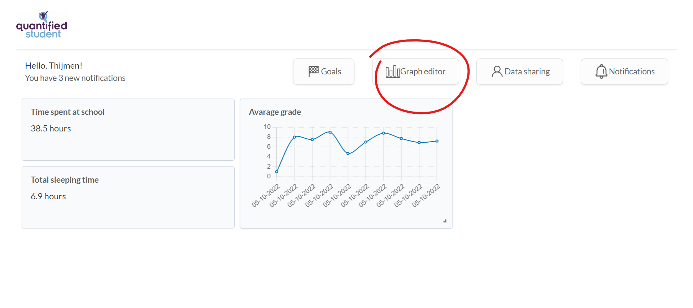
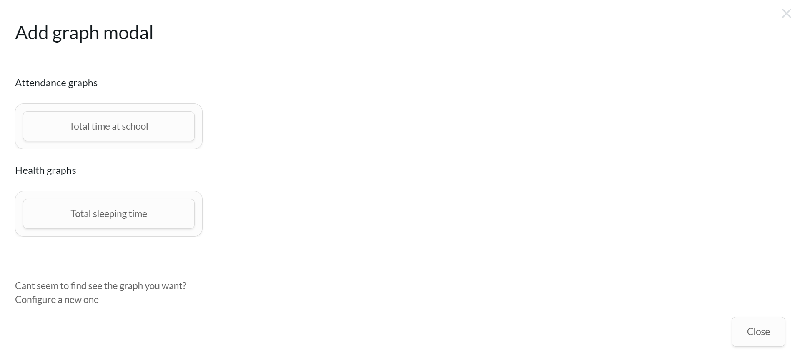
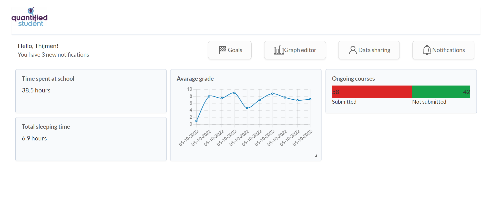
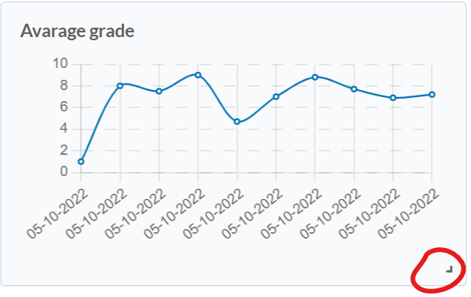
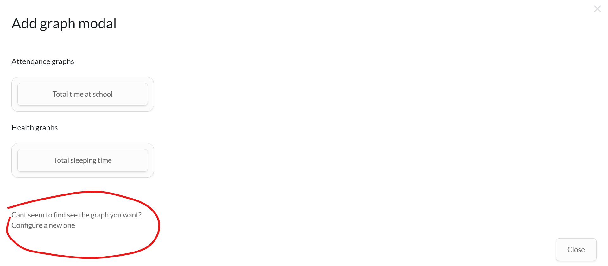
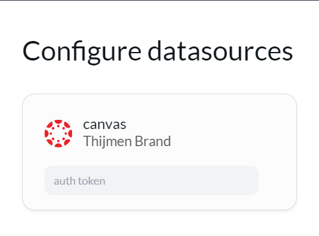

# Quantified student dashboard V2

The quantified student dashboard is the place where all the students' data is being gathered and showed to the user. He then can find for him important information and see trends, compare them against each other or just notice it.

## Table of contents
1. [Features](#features) 
    1. [Dashboard customization](#features-dashboard-customization)
    2. [Datasources selection](#features-datasource-selection)
    3. [datasharing](#features-datasharing)
    4. [goals](#features-goals)
2. [User guide](#practical)
    1. [Graph selection](#practical-graph-selection)
    2. [Dashboard personalisation](#practical-dashboard)
    3. [Graph timespan](#practical-timespan)
    4. [Datasource configuration](#practical-datasource-configuration)
    5. [Datasharing](#practical-datasharing)
    6. [Goals](#practical-goals)
3. [Technical](#technical)
    1. [Graph generation](#technical-graph-generation)
    2. [Dashboard layout](#technical-dashboard-layout)
    3. [Datasource configuration](#technical-datasource-configuration)

## Dashboard features
<a name="features" />

### Dashboard customization
<a name="features-dashboard-customization" />

We realise that not every student finds the same information valuable. for example one student finds its health data from great importance and thinks this influeces his preformance greatly, and the other takes great value from the actual canvas performance and his attendance. To accumulate for this difference in interest a student can compose his dashboard the way he wants it by adding different graphs and datapoints to the dashboard, resizing them to a preferenced size and drag them around.

to provide the student with even more customisation options he will be able to set the timespan on a avarage type graph. This provide that ability to look back further and to spot bigger trends or to see the performance over the span of a longer period of time

### Datasource selection
<a name="features-datasource-selection" />

Another key feature is the ability to configure new data points. We provide different data sources that require some extra steps. For example to see attendance data the student has to install a mobile application. And to see health data this same application is needed. And if a student doesn't find some of this information not valuable or does not want to share with the system he can choose to not configure this data source. The flip side of this however is that whenever a student chooses to not configure a datasouces the data is not available to the system and therefore can't be added to the dashboard.

### Datasharing
<a name="features-datasharing" />

Appart from drawing conclusions from your own data by looking at the trends and seeing the points, it may be valuable to be able to compare your data to another student. This has two effects. The first being that a student now can see the performance of one or multiple peers. This can be a measure for yourself and your own goals and performance. The other positive effect of this is the slight nudge form seeing your friends accomplishments. This can positively stimulate the student to crank up their own performance or for example only their attendance.

However, some data in the dashbaord can be quite personal. for example sleep times or health data and you wouldn't want that data to be on every peers' dashboard. Thats why you can shoose which datasources you want to share with you peers and this datasources are also the datasources the peer then shares with you.

### Goals
<a name="features-goals" />

Another thing the dashboard can do to simulate a student is the ability to set goals. A student can set a goals for a datapoint to reach a certain point or to be above a selected value for a certain amount of time. These goals then could be shared between peers to take the nudge effect a step further or to have a competition among peers.

## Practical documentation
<a name="practical" />

### Graph selection
<a name="practical-graph-selection" />

A user can select which data they want to show on their dashboard. This data then is displayed in a corresponding graph which shows the neceserry information the best. For a user choose this graph and add it to their dashboard go to the "Graph editor" panel.

1. Click on the graph editor button

This opens up the graph selection panel where you can choose which data you want to visualise on your dashboard.

2. Choose a datasource from the available options

After you have selected the graph of choise, it is being added to you dashboard

### Dashboard formation
<a name="practical-dashboard" />

Different students value different datasources over others. Thats the dashboard provides the ability to drag graph tiles around and mak some of them larger or smaller in size.

**Drag tiles around**

To drag a tile you hover with your mouse over the tile, press and hold the left mouse button and then you are able to drag it to the place you desire.

> \*Note: Tiles can only be placed on places there is a neighbouring tile.

**Resize tiles**

1. When you want to resize a tile and make the content of it bigger, you find the little arrow on the bottom-right corner of the tile.

2. Press and hold it with the left mouse button
3. drag it to the right or the bottom to make the tile bigger.

> \*NOTE: You can only resize certain tiles with the arrow symbol in the bottom-right.

> \*\*NOTE: The tile size increments or decrements with a fixed amount.

### Timespan selection
<a name="practical-timespan" />

> \*NOTE: Not implemented yet

### Datasource configuration
<a name="practical-datasource-configuration" />

Datapoints are children of different datasources. Therefore you have to have a datasource configured in your account in order to have access to the corresponding datapoint(s).

You do this as followed:

1. Navigate to the "Graph editor" panel by clicking the button

2. Click the "Can't seem to find the graph you want? Configure a new one" text at the left-bottom hand side of the screen

There you see a list of available datasources you can configure. In order to configure a datasource you must follow the steps that are prompted by the configuration.

For the example we will configure the canvas datasource which prompts us to provide the canvas authorization token.

3. Fill in the required configuration options
4. Close the panel and you see the newly available datasoures listed in the Graph editor panel.

### Datasharing
<a name="practical-datasharing" />

> NOTE: Not implemented yet

### Setting goals
<a name="practical-goals" />

> NOTE: Not implemented yet

## Technical documentation
<a name="technical" />

### Graph generation
<a name="technical-graph-generation" />

### Dashboard layout
<a name="technical-dashboard-layout" />

### Datasource configuration
<a name="technical-datasource-configuration" />

